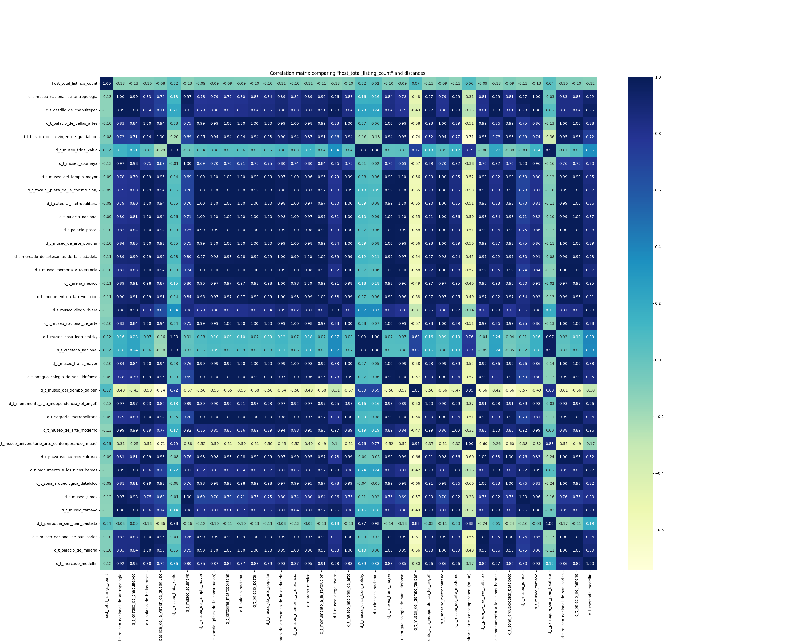
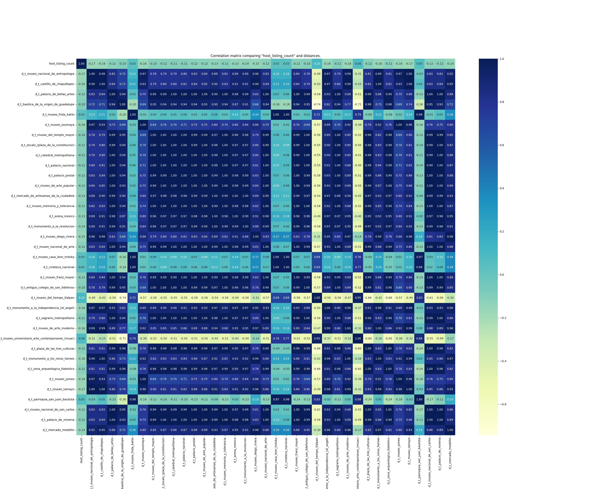

# Cultural Proximity Analytics: Short-Term Rentals and Cultural Hotspots :bar_chart:

<div align="center">


[](https://github.com/gstinoco/cultural-proximity-analytics) [](https://www.python.org/downloads/) [](https://pandas.pydata.org/) [](https://numpy.org/) [](https://seaborn.pydata.org/) [](https://matplotlib.org/) [-8CAAE6.svg?logo=scipy)](https://scipy.org/) [](LICENSE)

**Reproducible workflow to compute distances (Haversine) and analyze correlations between host variables and proximity to cultural hotspots**

*Short-term rentals (hosts/listings) -> distances to cultural hotspots -> correlation matrices (Pearson)*

### :link: Quick Links
[](#rocket-quick-start) [](#package-installation--requirements) [](#file_cabinet-dataset-structure) [](#file_cabinet-data-formats) [](#chart_with_upwards_trend-performance-benchmarks) [](#movie_camera-results--visualizations) [](#scientist-research-team) [](#factory-industry-partners-supporting-innovation) [](#pray-acknowledgments) [](#email-contact--support)

</div>

---

## :clipboard: Table of Contents
- [Overview](#star2-overview)
- [Scope and Features](#sparkles-scope-and-features)
- [Installation & Requirements](#package-installation--requirements)
- [Quick Start](#rocket-quick-start)
- [Usage Guide](#book-usage-guide)
- [Data Formats](#file_cabinet-data-formats)
- [Project Architecture](#open_file_folder-project-architecture)
- [Methodology](#books-methodology)
- [Dataset Structure](#file_cabinet-dataset-structure)
- [Performance Benchmarks](#chart_with_upwards_trend-performance-benchmarks)
- [Results & Visualizations](#movie_camera-results--visualizations)
- [Research Team](#scientist-research-team)
- [Industry Partners Supporting Innovation](#factory-industry-partners-supporting-innovation)
- [Citation & License](#memo-citation--license)
- [Acknowledgments](#pray-acknowledgments)
- [Contact](#email-contact--support)
- [FAQ](#speech_balloon-faq)

---

## :star2: Overview

This repository implements an analysis workflow to:

- Compute **geographical distances** from short-term rental listings to a set of **cultural hotspots** in a city using the **Haversine** formula (km).
- Generate an output dataset with all distances appended and ready for analysis.
- Compute **Pearson correlations** between a target host variable (e.g., superhost, listings count, or a host-level derived count) and distances to cultural hotspots.
- Export results as **correlation matrices** (PNG/PDF) and a **machine-readable correlation table** (CSV) with p-values and BH-FDR q-values (when SciPy is available).

Included in this repository:
- [Correlations.py](Correlations.py): runnable script (full pipeline).

### :wrench: Key Capabilities
- **:triangular_ruler: Distance computation**: Haversine distances (km) from each listing to multiple hotspots.
- **:bar_chart: Correlation analysis**: Pearson correlation for existing variables and derived count-based variables.
- **:framed_picture: Publication-ready outputs**: heatmap correlation matrices exported to PNG and PDF.
- **:floppy_disk: Reproducible artifacts**: CSV outputs + `.tar.gz` compression for portability + place name/slug mapping.

### :microscope: Typical Use Cases

| Area | Question | Output |
|------|----------|--------|
| **Urban analytics** :cityscape: | Are high-volume hosts closer to cultural hotspots? | Correlations across distances |
| **Tourism studies** :classical_building: | Which hotspots show the strongest proximity effects? | Ranked correlation values |
| **Spatial data science** :compass: | How do host attributes relate to cultural accessibility? | Heatmaps + summary statistics |

---

## :sparkles: Scope and Features

### :triangular_ruler: Distances (Haversine)
- Reads a listings/hosts dataset with **latitude/longitude**.
- Reads a cultural hotspots dataset with **name/latitude/longitude**.
- Adds one distance column per hotspot using the `d_t_<slug>` prefix (km), where `<slug>` is an ASCII-safe normalized label derived from `place_name`.
- Filters relevant columns, maps `host_is_superhost` to 0/1, and removes missing rows.
- Exports the final CSV, a compressed `.tar.gz` copy, and a `<result>_places_mapping.csv` file to map `place_name -> place_slug`.

### :bar_chart: Correlations
- Computes Pearson correlations between:
  - An **existing variable** (e.g., `host_is_superhost`, `host_total_listings_count`) and distances, or
  - A **derived variable** based on counts (e.g., `listing_count` by `host_id`) and distances.
- Generates and saves a **correlation matrix** (PNG and PDF) using Seaborn/Matplotlib.
- Exports a per-distance **correlation summary table** (CSV) with correlation, `n`, p-value, and BH-FDR q-value (if SciPy is available).

---

## :package: Installation & Requirements

### :computer: System Requirements
- Python **3.x**
- (Optional) Jupyter to run the notebook

### :clipboard: Dependencies

```bash
pip install numpy pandas seaborn matplotlib
```

Note: `tarfile` is part of Python’s standard library (you do not install it via pip).

Optional (recommended for p-values and multiple-testing correction outputs):

```bash
pip install scipy
```

### :white_check_mark: Installation Verification

```bash
python -c "import numpy, pandas, seaborn, matplotlib; print('Installation successful!')"
```

---

## :rocket: Quick Start

<table>
  <thead>
    <tr>
      <th align="left" width="170">Step</th>
      <th align="left">What to do</th>
    </tr>
  </thead>
  <tbody>
    <tr>
      <td><b>1) Prepare data</b></td>
      <td>
        Extract the CSV files included in <code>Information/</code>:<br/>
        <pre><code>tar -xzf Information/hosts.tar.gz -C Information
tar -xzf Information/cultural_places.tar.gz -C Information</code></pre>
      </td>
    </tr>
    <tr>
      <td><b>2) Run</b></td>
      <td>
        <pre><code>python Correlations.py</code></pre>
      </td>
    </tr>
    <tr>
      <td><b>3) Check outputs</b></td>
      <td>
        Files are generated under <code>Results/</code>:<br/>
        <code>hosts_with_distances_cultural.csv</code> (and <code>.tar.gz</code>) + <code>hosts_with_distances_cultural_places_mapping.csv</code> + matrices <code>Correlation_Matrix_*.png/.pdf</code> + tables <code>Correlation_Matrix_*_corr_table.csv</code>.
      </td>
    </tr>
  </tbody>
</table>

---

## :book: Usage Guide

### :gear: Running the pipeline (script)

The default flow in [Correlations.py](Correlations.py) performs:

1. Distance computation:
   - Inputs: `Information/hosts.csv`, `Information/cultural_places.csv`
   - Output: `Results/hosts_with_distances_cultural.csv` (+ compression)
2. Three correlation experiments:
   - Test 1: `host_is_superhost`
   - Test 2: `host_total_listings_count`
   - Test 3: `host_id` (transformed into `listing_count` per host)

### :test_tube: Using as a library (functions)

```python
from Correlations import (
    distances,
    correlate_against_variable,
    correlate_against_listing_count,
)

distances(
    hosts="Information/hosts.csv",
    places="Information/cultural_places.csv",
    result="Results/hosts_with_distances_cultural.csv",
)

correlate_against_variable(
    filename="Results/hosts_with_distances_cultural.csv",
    variable="host_is_superhost",
    matrix_path="Results/Correlation_Matrix_1",
)

correlate_against_listing_count(
    filename="Results/hosts_with_distances_cultural.csv",
    variable="host_id",
    matrix_path="Results/Correlation_Matrix_3",
)
```

---

## :file_cabinet: Data Formats

### :house: `hosts.csv` (listings / hosts)

Must include, at minimum:
- `latitude`, `longitude`
- Host variables to analyze, for example: `host_is_superhost`, `host_total_listings_count`, `host_id`

The script also uses (and/or preserves) identification columns like `id`, `host_url`, `host_name`, etc.

### :classical_building: `cultural_places.csv` (cultural hotspots)

Must include:
- `place_name`: original label used to build a stable ASCII slug
- `latitude`, `longitude`

The pipeline will generate distance columns named `d_t_<place_slug>` and will write a mapping file:
- `<result>_places_mapping.csv` containing `place_name`, `place_slug`, `latitude`, `longitude`

---

## :open_file_folder: Project Architecture

```
Cultural-Proximity-Analytics/
├── Correlations.py                     # Pipeline: distances + correlations + exports
├── Information/                        # Input datasets (tar.gz containing CSV)
│   ├── hosts.tar.gz
│   └── cultural_places.tar.gz
├── Results/                            # Outputs (CSV, PNG, PDF)
│   ├── hosts_with_distances_cultural.csv.tar.gz
│   ├── hosts_with_distances_cultural_places_mapping.csv
│   ├── Correlation_Matrix_1.png/.pdf
│   ├── Correlation_Matrix_2.png/.pdf
│   └── Correlation_Matrix_3.png/.pdf
│   ├── Correlation_Matrix_1_corr_table.csv
│   ├── Correlation_Matrix_2_corr_table.csv
│   └── Correlation_Matrix_3_corr_table.csv
├── docs/                               # Project assets (logo, figures, team)
└── LICENSE
```

---

## :books: Methodology

### :triangular_ruler: Geographical distance (Haversine)

For each listing with coordinates $(\phi_1, \lambda_1)$ and cultural hotspot $(\phi_2, \lambda_2)$, the distance in km is computed using the Haversine formula (implemented in NumPy for speed).

### :bar_chart: Correlations (Pearson)

Let $X$ be a host variable (existing or derived) and $D_k$ the distance to hotspot $k$. We compute:
- $\rho(X, D_k)$ using Pearson correlation.

The full matrix is visualized as a heatmap and exported to PNG/PDF.

---

## :file_cabinet: Dataset Structure

This repository ships example inputs as compressed archives under `Information/`:

```text
Information/
├── hosts.tar.gz              # Contains hosts.csv
└── cultural_places.tar.gz    # Contains cultural_places.csv
```

Outputs are written to `Results/` when running the pipeline:

```text
Results/
├── hosts_with_distances_cultural.csv.tar.gz
├── Correlation_Matrix_1.png/.pdf
├── Correlation_Matrix_2.png/.pdf
└── Correlation_Matrix_3.png/.pdf
```

README assets are stored under `docs/` (logo, figures, team photos).

---

## :chart_with_upwards_trend: Performance Benchmarks

The pipeline is designed for straightforward batch analysis. Runtime depends on the number of listings and hotspots.

### :stopwatch: Scaling Overview

| Stage | Core operation | Typical scaling |
|-------|----------------|-----------------|
| Distance computation | Haversine per listing × hotspot | ~ proportional to (N listings × M hotspots) |
| Correlations | Pearson correlations on numeric columns | ~ proportional to number of rows and variables |
| Visualization/export | Heatmap rendering + file writes | ~ proportional to matrix size |

---

## :movie_camera: Results & Visualizations

### :framed_picture: Examples Gallery

Correlation matrices generated by the included example run (stored under `docs/figures/` for README rendering):

<div align="center">

<table>
  <tr>
    <td align="center" width="33%">
      <b>Test 1</b><br/>
      <sub>Variable: <code>host_is_superhost</code></sub><br/><br/>
      <a href="docs/figures/Correlation_Matrix_1.png"></a><br/><br/>
      <a href="Results/Correlation_Matrix_1.pdf"><code>PDF</code></a> · <a href="Results/Correlation_Matrix_1.png"><code>PNG</code></a>
    </td>
    <td align="center" width="33%">
      <b>Test 2</b><br/>
      <sub>Variable: <code>host_total_listings_count</code></sub><br/><br/>
      <a href="docs/figures/Correlation_Matrix_2.png"></a><br/><br/>
      <a href="Results/Correlation_Matrix_2.pdf"><code>PDF</code></a> · <a href="Results/Correlation_Matrix_2.png"><code>PNG</code></a>
    </td>
    <td align="center" width="33%">
      <b>Test 3</b><br/>
      <sub>Derived: <code>listing_count</code> per <code>host_id</code></sub><br/><br/>
      <a href="docs/figures/Correlation_Matrix_3.png"></a><br/><br/>
      <a href="Results/Correlation_Matrix_3.pdf"><code>PDF</code></a> · <a href="Results/Correlation_Matrix_3.png"><code>PNG</code></a>
    </td>
  </tr>
</table>

</div>

---

## :scientist: Research Team

<div align="center">

### :star2: Meet the Team
*Researchers and students contributing to this project*

</div>

### :busts_in_silhouette: Main Researchers

<table align="center">
  <thead>
    <tr>
      <th align="center" width="120">Photo</th>
      <th align="left">Researcher</th>
      <th align="left">Affiliation</th>
      <th align="left">Contact</th>
    </tr>
  </thead>
  <tbody>
    <tr>
      <td align="center" width="120">
        
      </td>
      <td>
        <b>Dr. Gerardo Tinoco-Guerrero</b> :mexico:<br/>
        <sub>Geospatial Analytics &amp; Computational Methods</sub>
      </td>
      <td>
        <a href="http://www.siiia.com.mx"></a><br/>
        <a href="http://www.umich.mx"></a>
      </td>
      <td>
        <a href="mailto:gerardo.tinoco@umich.mx"></a><br/>
        <a href="https://orcid.org/0000-0003-3119-770X"></a>
      </td>
    </tr>
    <tr>
      <td align="center" width="120">
        
      </td>
      <td>
        <b>Dr. José Alberto Guzmán-Torres</b> :mexico:<br/>
        <sub>Urban Analytics &amp; Data-Driven Modeling</sub>
      </td>
      <td>
        <a href="http://www.siiia.com.mx"></a><br/>
        <a href="http://www.umich.mx"></a>
      </td>
      <td>
        <a href="mailto:jose.alberto.guzman@umich.mx"></a><br/>
        <a href="https://orcid.org/0000-0002-9309-9390"></a>
      </td>
    </tr>
    <tr>
      <td align="center" width="120">
        
      </td>
      <td>
        <b>Dr. Narciso Salvador Tinoco-Guerrero</b> :mexico:<br/>
        <sub>Statistical Modeling &amp; Applied Research</sub>
      </td>
      <td>
        <a href="http://www.umich.mx"></a><br/>
        <a href="https://www.uvaq.edu.mx/"></a>
      </td>
      <td>
        <a href="mailto:narciso.tinoco@umich.mx"></a><br/>
        <a href="https://orcid.org/0000-0003-1209-1184"></a>
      </td>
    </tr>
  </tbody>
</table>

### :handshake: Collaborators

<table align="center">
  <thead>
    <tr>
      <th align="center" width="120">Photo</th>
      <th align="left">Collaborator</th>
      <th align="left">Affiliation</th>
      <th align="left">Contact</th>
    </tr>
  </thead>
  <tbody>
    <tr>
      <td align="center" width="120">
        
      </td>
      <td>
        <b>Dr. Francisco Javier Domínguez-Mota</b> :mexico:<br/>
        <sub>Applied Mathematics &amp; Scientific Computing</sub>
      </td>
      <td>
        <a href="http://www.umich.mx"></a><br/>
        <a href="https://aulas.cimne.com/aula/aula-morelia/"></a>
      </td>
      <td>
        <a href="mailto:francisco.mota@umich.mx"></a>
      </td>
    </tr>
    <tr>
      <td align="center" width="120">
        
      </td>
      <td>
        <b>Dr. Heriberto Árias-Rojas</b> :mexico:<br/>
        <sub>Engineering Applications</sub>
      </td>
      <td>
        <a href="http://www.umich.mx"></a><br/>
        <a href="https://aulas.cimne.com/aula/aula-morelia/"></a>
      </td>
      <td>
        <a href="mailto:heriberto.arias@umich.mx"></a>
      </td>
    </tr>
  </tbody>
</table>

### :mortar_board: Ph.D. Research Students

<table align="center">
  <thead>
    <tr>
      <th align="center" width="120">Photo</th>
      <th align="left">Student</th>
      <th align="left">Institution</th>
      <th align="left">Contact</th>
    </tr>
  </thead>
  <tbody>
    <tr>
      <td align="center" width="120">
        
      </td>
      <td>
        <b>Gabriela Pedraza-Jiménez</b><br/>
        
      </td>
      <td>
        <a href="http://www.umich.mx"></a>
      </td>
      <td>
        <a href="mailto:2220157h@umich.mx"></a>
      </td>
    </tr>
    <tr>
      <td align="center" width="120">
        
      </td>
      <td>
        <b>Eli Chagolla-Inzunza</b><br/>
        
      </td>
      <td>
        <a href="http://www.umich.mx"></a>
      </td>
      <td>
        <a href="mailto:1137626b@umich.mx"></a>
      </td>
    </tr>
  </tbody>
</table>

### :mortar_board: M.Sc. Research Students

<table align="center">
  <thead>
    <tr>
      <th align="center" width="120">Photo</th>
      <th align="left">Student</th>
      <th align="left">Institution</th>
      <th align="left">Contact</th>
    </tr>
  </thead>
  <tbody>
    <tr>
      <td align="center" width="120">
        
      </td>
      <td>
        <b>Jorge L. González-Figueroa</b><br/>
        
      </td>
      <td>
        <a href="http://www.umich.mx"></a>
      </td>
      <td>
        <a href="mailto:1718717h@umich.mx"></a>
      </td>
    </tr>
    <tr>
      <td align="center" width="120">
        
      </td>
      <td>
        <b>Christopher N. Magaña-Barocio</b><br/>
        
      </td>
      <td>
        <a href="http://www.umich.mx"></a>
      </td>
      <td>
        <a href="mailto:1339846k@umich.mx"></a>
      </td>
    </tr>
  </tbody>
</table>

### :mortar_board: Undergraduate Research Students

<table align="center">
  <thead>
    <tr>
      <th align="center" width="120">Photo</th>
      <th align="left">Student</th>
      <th align="left">Institution</th>
      <th align="left">Contact</th>
    </tr>
  </thead>
  <tbody>
    <tr>
      <td align="center" width="120">
        
      </td>
      <td>
        <b>Maria Goretti Fraga-Lopez</b><br/>
        
      </td>
      <td>
        <a href="http://www.umich.mx"></a>
      </td>
      <td>
        <a href="mailto:1702174b@umich.mx"></a>
      </td>
    </tr>
  </tbody>
</table>

---

## :factory: Industry Partners Supporting Innovation

<div align="center">

### :star2: Industry Partners Supporting Innovation
*Collaboration between academia and industry to accelerate real-world impact*

</div>

<div align="center">

<table align="center" width="70%">
<tr>
<td align="center">

### :factory: **SIIIA MATH**
#### *Soluciones en Ingeniería, Mexico*

<div align="center">

[](http://www.siiia.com.mx)
[](http://www.siiia.com.mx)
[](http://www.siiia.com.mx)

</div>

**🎯 Focus areas:**
- Mathematical modeling &amp; simulation
- AI/ML engineering solutions
- Technology transfer and applied R&amp;D

<div align="center">

[](mailto:gtinoco@siiia.com.mx)

</div>

</td>
</tr>
</table>

</div>

---

## :memo: Citation & License

### :page_facing_up: License

This project is distributed under the [MIT License](LICENSE).

### :bookmark: Suggested citation

```bibtex
@software{tinoco2024citc_airbnb,
  title        = {Cultural Proximity Analytics: Distance and correlation analysis (short-term rentals and cultural hotspots)},
  author       = {Tinoco-Guerrero, Gerardo and Guzmán-Torres, José Alberto and Tinoco-Guerrero, Narciso Salvador},
  year         = {2024},
  institution  = {Universidad Michoacana de San Nicolás de Hidalgo},
  note         = {Geographical distance computation (Haversine) and correlation analysis (Pearson) between host variables and proximity to cultural hotspots.}
}
```

---

## :pray: Acknowledgments

<div align="center">

### :heart: Special Thanks
*We extend our gratitude to the institutions and partners supporting this research*

</div>

### :classical_building: Institutional Support

<table align="center" width="100%" cellspacing="14">
  <tr>
    <td width="50%" valign="top">
      <div style="border: 1px solid #d0d7de; border-radius: 12px; padding: 16px;">
        <div align="center">
          <b>🎓 Universidad Michoacana de San Nicolás de Hidalgo (UMSNH)</b><br/>
          <sub>Academic institution, Mexico</sub><br/><br/>
          <a href="http://www.umich.mx"></a>
          
          
        </div>
        <br/>
        <b>Key support</b>
        <ul>
          <li>Research infrastructure and academic environment</li>
          <li>Scientific training and supervision</li>
        </ul>
      </div>
    </td>
    <td width="50%" valign="top">
      <div style="border: 1px solid #d0d7de; border-radius: 12px; padding: 16px;">
        <div align="center">
          <b>💰 SeCiHTI</b><br/>
          <sub>Secretariat of Science, Humanities, Technology and Innovation, Mexico</sub><br/><br/>
          <a href="http://secihti.mx/"></a>
          
          
        </div>
        <br/>
        <b>Key support</b>
        <ul>
          <li>Research funding and scientific development</li>
          <li>Support for open research outputs</li>
        </ul>
      </div>
    </td>
  </tr>
  <tr>
    <td width="50%" valign="top">
      <div style="border: 1px solid #d0d7de; border-radius: 12px; padding: 16px;">
        <div align="center">
          <b>🌿 Centre Internacional de Mètodes Numèrics en Enginyeria (CIMNE)</b><br/>
          <sub>Research center, Spain</sub><br/><br/>
          <a href="https://www.cimne.com/"></a>
          
          
        </div>
        <br/>
        <b>Key support</b>
        <ul>
          <li>International collaboration and research environment</li>
          <li>Academic and applied computing exchange</li>
        </ul>
      </div>
    </td>
    <td width="50%" valign="top">
      <div style="border: 1px solid #d0d7de; border-radius: 12px; padding: 16px;">
        <div align="center">
          <b>🏭 SIIIA MATH: Soluciones en Ingeniería</b><br/>
          <sub>Industry partner, Mexico</sub><br/><br/>
          <a href="http://www.siiia.com.mx"></a>
          
          
        </div>
        <br/>
        <b>Key support</b>
        <ul>
          <li>Applied R&amp;D perspective and real-world relevance</li>
          <li>Industry-academia collaboration</li>
        </ul>
      </div>
    </td>
  </tr>
</table>

### :building_with_garden: Research Centers & Collaborations

<div align="center">

<table align="center" width="100%" cellspacing="14">
  <tr>
    <td width="50%" valign="top">
      <div style="border: 1px solid #d0d7de; border-radius: 12px; padding: 16px;">
        <div align="center">
          <b>🌿 Aula CIMNE-Morelia</b><br/>
          <sub>Research collaboration space</sub><br/><br/>
          <a href="https://aulas.cimne.com/aula/aula-morelia/"></a>
          
          
        </div>
        <br/>
        <b>Collaboration highlights</b>
        <ul>
          <li>Numerical methods and computational engineering environment</li>
          <li>Scientific collaboration and training activities</li>
        </ul>
      </div>
    </td>
    <td width="50%" valign="top">
      <div style="border: 1px solid #d0d7de; border-radius: 12px; padding: 16px;">
        <div align="center">
          <b>🎓 UMSNH</b><br/>
          <sub>Academic collaboration</sub><br/><br/>
          <a href="http://www.umich.mx"></a>
          
          
        </div>
        <br/>
        <b>Collaboration highlights</b>
        <ul>
          <li>Institutional support for research and training</li>
          <li>Graduate formation and supervision for scientific computing</li>
        </ul>
      </div>
    </td>
  </tr>
</table>

</div>

---

## :email: Contact & Support

<div align="center">

*Contact channels, technical support, and collaboration opportunities*

[](https://github.com/gstinoco/cultural-proximity-analytics/issues)
[](mailto:gerardo.tinoco@umich.mx)

</div>

<table align="center" width="100%" cellspacing="14">
  <tr>
    <td valign="top" style="border: 1px solid #d0d7de; border-radius: 12px; padding: 16px;">
      <div align="center">
        <b>Primary Contact</b><br/>
        <sub>Research coordination</sub>
      </div>
      <br/>
      <b>Dr. Gerardo Tinoco-Guerrero</b><br/>
      <sub>Morelia, Michoacán, Mexico</sub>
      <br/><br/>
      <div align="center">
        <a href="mailto:gerardo.tinoco@umich.mx"></a>
        <a href="http://www.siiia.com.mx"></a>
        <a href="http://www.umich.mx"></a>
      </div>
    </td>
  </tr>
  <tr>
    <td valign="top" style="border: 1px solid #d0d7de; border-radius: 12px; padding: 16px;">
      <div align="center">
        <b>Technical Support</b><br/>
        <sub>Bug reports, questions, and collaboration requests</sub>
      </div>
      <br/>
      <div align="center">
        <a href="https://github.com/gstinoco/cultural-proximity-analytics/issues"></a>
        <a href="mailto:gerardo.tinoco@umich.mx"></a>
        <a href="mailto:gerardo.tinoco@umich.mx?subject=Cultural%20Proximity%20Analytics%20Collaboration"></a>
      </div>
      <br/>
      <ul>
        <li><b>Issues</b> for bugs and feature requests</li>
        <li><b>Email</b> for technical inquiries</li>
        <li><b>Collaboration</b> for partnerships and joint projects</li>
      </ul>
    </td>
  </tr>
  <tr>
    <td valign="top" style="border: 1px solid #d0d7de; border-radius: 12px; padding: 16px;">
      <div align="center">
        <b>Collaboration Opportunities</b><br/>
        <sub>Research and engineering partnerships</sub>
      </div>
      <br/>
      <table width="100%">
        <tr>
          <td width="50%"><b>🗺️ Geospatial Analytics</b><br/><sub>distance-to-hotspot computation, spatial feature engineering</sub></td>
          <td width="50%"><b>📍 Urban &amp; Cultural Data</b><br/><sub>cultural hotspots, accessibility, spatial indicators</sub></td>
        </tr>
        <tr>
          <td width="50%"><b>📈 Spatial Statistics</b><br/><sub>correlation analysis, robustness checks, interpretation</sub></td>
          <td width="50%"><b>🧰 Reproducible Pipelines</b><br/><sub>open datasets, scripts, and publication-ready outputs</sub></td>
        </tr>
        <tr>
          <td width="50%"><b>🏙️ Tourism &amp; Mobility</b><br/><sub>proximity effects, hospitality patterns, urban studies</sub></td>
          <td width="50%"></td>
        </tr>
      </table>
    </td>
  </tr>
  <tr>
    <td valign="top" style="border: 1px solid #d0d7de; border-radius: 12px; padding: 16px;">
      <div align="center">
        <b>Student Opportunities</b><br/>
        <sub>Projects and training in data science and geospatial analytics</sub>
      </div>
      <br/>
      <ul>
        <li><b>Graduate Programs</b>: research opportunities with the team</li>
        <li><b>Undergraduate Projects</b>: thesis topics in urban and spatial data science</li>
        <li><b>Internships</b>: analytics workflows, visualization, and reproducible research</li>
      </ul>
    </td>
  </tr>
  <tr>
    <td valign="top" style="border: 1px solid #d0d7de; border-radius: 12px; padding: 16px;">
      <div align="center">
        <b>Institutional Affiliations</b>
      </div>
      <br/>
      <div align="center">
        <a href="http://www.siiia.com.mx"></a>
        <a href="http://www.umich.mx"></a>
        <a href="https://www.uvaq.edu.mx/"></a>
        
      </div>
    </td>
  </tr>
</table>

---

## :speech_balloon: FAQ

<details>
  <summary><b>Do I need Jupyter?</b></summary>
  <br/>
  No. You can run the full pipeline with <code>python Correlations.py</code>.
</details>

<details>
  <summary><b>Why are the example inputs packaged as .tar.gz files?</b></summary>
  <br/>
  To keep example datasets compact and easy to distribute. Extract them into <code>Information/</code> before running the script.
</details>

<details>
  <summary><b>How do I add a new cultural hotspot?</b></summary>
  <br/>
  Add a row to <code>Information/cultural_places.csv</code> with <code>place_name, latitude, longitude</code>. The pipeline will generate a new distance column (<code>d_t_&lt;slug&gt;</code>) automatically and will record the mapping in <code>&lt;result&gt;_places_mapping.csv</code>.
</details>

---

<div align="center">

*Advancing reproducible geospatial analytics through open-source collaboration*

[](https://github.com/gstinoco/cultural-proximity-analytics/stargazers) [](https://github.com/gstinoco/cultural-proximity-analytics/network/members) [](https://github.com/gstinoco/cultural-proximity-analytics/watchers)

<br/>

<b>If this project helps your research, please consider giving it a star.</b>

</div>
